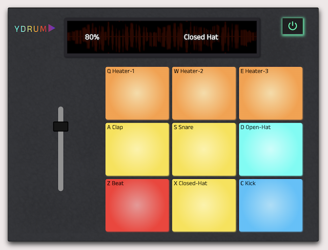

# ReactDrumMachine

<h2><a href="https://codepen.io/yansht/pen/GRQaJQr" rel="nofollow">Live Demo</a></h2>

This project uses React to build a drum machine.

<b>Project functionality:</b>
- Drum consists of volume controller which controlles the sound of the played pads.
- When clicking each individual drum pad it triggers an audio tag which than plays the src audio.
- An ON/OFF button: 
when turned OFF -> the pad name on screen resets to empty & unable to play the volume.
when ON -> The default behaviour works.

A -Referencer- class which holds playSound method that when Drum is ON, the sound will play, and display will be updated accordingly with the triggered key pad name.
Ths class will render props for the div classes and id's to return next in class PadBank.
  
A -PadBank- class maps over the Array objects and returns withing the -Referencer- class, for each their own properties. finally -PadBank- will return the whole div parent set up for drum pads.
  
Finally class -App- holds initial states for the drum power, array, display pad name, and initial volume.
 
The PowerControl method initial state set to true, so the page will start with drum ON.
than each object will be bound to PowerControl method, otherwise all is off.

FreeCodeCamp project: building 'React Drum Machine' -->  
https://www.freecodecamp.org/learn/front-end-development-libraries/#react-and-redux
